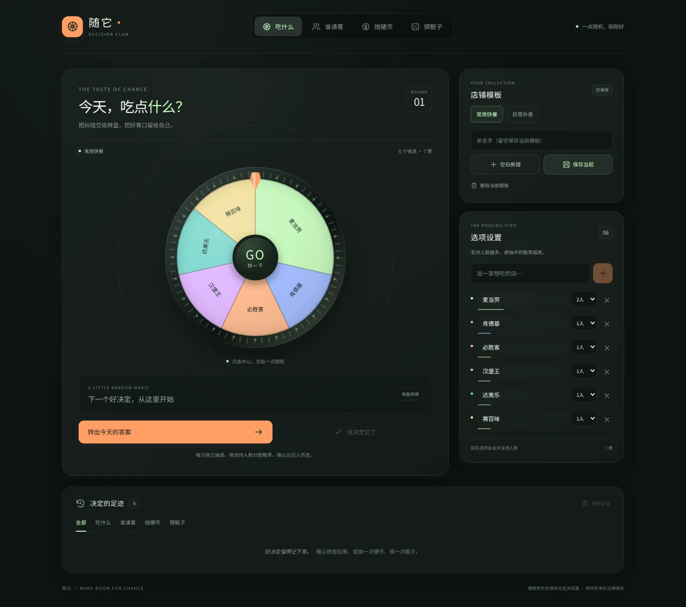

# 随它 · Decision Club

聚餐和小游戏用的随机选择工具：加权大转盘、谁请客老虎机、抛硬币、1–6 个骰子。使用 React 19 + Vite 8，无账户、无服务端、无新增运行时依赖。

## 本地运行

```sh
npm ci
npm run dev
```

```sh
npm run lint
npm test
npm run build
```

## 使用与数据

- 转盘和老虎机按支持人数加权抽选；重复名字合并权重，上限为 20。
- 点击“就决定它了”后记入历史；硬币和骰子落定后自动记录。
- 名单修改后点击“保存当前”；模板名称留空会保存到当前模板，填写新名字可另存。
- 空白模板可以保存；删除最后一个模板后不会自动恢复默认名单。
- 切换功能保留未保存的名单和正在进行的抽选；刷新前会提示未保存修改。
- 数据继续使用原有 `decision-party-app-pro-v5` 存储键，已有模板和历史可沿用。
- 数据保存在当前浏览器，清缓存或换设备不会同步。无法写入时页面显示提示。
- 尊重系统“减少动态效果”设置，抽选规则保持一致。

## 此次修复

1. 修复空白模板刷新消失、删除全部模板后默认模板重新出现。
2. 抽选期间锁定模板和选项，避免指针与开奖结果不同步。
3. 编辑行使用稳定位置键，输入名称时不再丢失焦点；中文输入法回车不误提交。
4. 空白新建不再覆盖同名模板，保存按钮支持直接保存当前模板；切换未保存模板前会提醒。
5. 硬币提前确定落点，视觉朝向与记录一致；骰子修正 3/4 面朝向，尺寸与立方体深度一致。
6. 清理全部动画计时器，移除骰子持续刷新的 interval，防止卸载残留。
7. 修复无效时间显示、中文页面语言和手机安全区域；振动不可用时不会中断抽选。

## 验证

`npm test` 覆盖空模板存取、空集合与坏数据回退、加权边界、连续 100 次指针对齐、权重/历史清洗与存储异常。另外已用 Chromium 实测输入焦点、切页草稿、模板刷新、转盘指针对齐、抽选锁定、老虎机停靠、硬币两面、骰子六面与总和、历史记录，以及系统减少动态效果。四种功能在 320/390/768/1440 px 宽度下无横向溢出。

## 界面预览



[手机界面](docs/mobile.webp)
